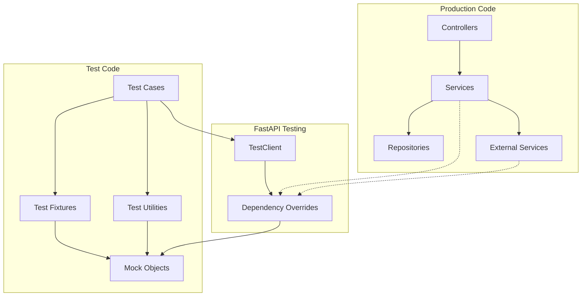

# 設計書

## 概要

バックエンドのテスト改善により、本番コードからテスト用の処理を完全に分離し、FastAPIのベストプラクティスに従った適切なテスト設計を実現する。現在の問題点を解決し、保守性と信頼性を向上させる。

## アーキテクチャ

### 現在の問題点

1. **本番コードへのテスト処理混入**
   - `PYTEST_CURRENT_TEST`環境変数の確認
   - `unittest.mock`の動的インポート
   - Mock検出ロジック
   - テスト固有の条件分岐

2. **テスト設計の問題**
   - テスト用の後方互換ラッパー関数
   - 本番コードでのテスト状態管理
   - テストとプロダクションの境界が曖昧

3. **依存性管理の問題**
   - 適切な依存性注入の未活用
   - テストダブルの不適切な実装

### 改善後のアーキテクチャ



## コンポーネントと インターフェース

### 1. テストフィクスチャの再設計

#### 現在の問題
- `conftest.py`でリポジトリ関数を直接呼び出し
- テスト用の処理が本番コードに混入

#### 改善案
```python
# backend/tests/conftest.py
@pytest.fixture(name="mock_clerk_service")
def mock_clerk_service_fixture():
    """Clerk service mock fixture"""
    with patch("app.services.clerk_service.get_clerk_service") as mock:
        mock_service = MagicMock()
        mock_service.get_user_plan.return_value = "standard"
        mock.return_value = mock_service
        yield mock_service

@pytest.fixture(name="mock_ai_usage_repository")
def mock_ai_usage_repository_fixture():
    """AI usage repository mock fixture"""
    with patch("app.repositories.ai_chat_usage.AIChatUsageRepository") as mock:
        yield mock
```

### 2. 依存性注入の活用

#### サービス層の改善
```python
# app/services/ai_chat_usage_service.py
class AIChatUsageService:
    def __init__(
        self,
        session: Session,
        clerk_service: Optional[ClerkService] = None,
        usage_repository: Optional[AIChatUsageRepository] = None
    ):
        self.session = session
        self.clerk_service = clerk_service or get_clerk_service()
        self.usage_repository = usage_repository or AIChatUsageRepository()
```

#### テストでの依存性オーバーライド
```python
# tests/unit/test_ai_chat_usage_service.py
@pytest.fixture
def service_with_mocks(session, mock_clerk_service, mock_usage_repository):
    return AIChatUsageService(
        session=session,
        clerk_service=mock_clerk_service,
        usage_repository=mock_usage_repository
    )
```

### 3. テストユーティリティの作成

#### テスト専用ユーティリティ
```python
# backend/tests/utils/test_helpers.py
class TestDataFactory:
    @staticmethod
    def create_user(
        id: int = 1,
        clerk_sub: str = "test_user_123",
        email: str = "test@example.com"
    ) -> User:
        return User(
            id=id,
            clerk_sub=clerk_sub,
            email=email,
            created_at=time.time(),
            updated_at=time.time()
        )

    @staticmethod
    def create_usage_record(
        user_id: int,
        usage_date: str,
        usage_count: int = 1
    ) -> AIChatUsage:
        return AIChatUsage(
            user_id=user_id,
            usage_date=usage_date,
            usage_count=usage_count,
            created_at=time.time(),
            updated_at=time.time()
        )
```

### 4. 統合テストの改善

#### APIテストの標準化
```python
# tests/integration/test_ai_chat_usage_api.py
class TestAIChatUsageAPI:
    @pytest.fixture(autouse=True)
    def setup_dependencies(self, mock_clerk_service, mock_usage_repository):
        """Setup all necessary mocks for integration tests"""
        # Configure mocks for integration testing
        pass

    def test_usage_endpoint_success(self, client, test_user):
        """Test successful usage check"""
        # Use dependency overrides instead of environment variables
        pass
```

## データモデル

### テストデータの管理

#### ファクトリーパターンの採用
```python
# backend/tests/factories/user_factory.py
class UserFactory:
    @staticmethod
    def build(**kwargs) -> User:
        defaults = {
            "id": 1,
            "clerk_sub": "test_user_123",
            "email": "test@example.com",
            "created_at": time.time(),
            "updated_at": time.time()
        }
        defaults.update(kwargs)
        return User(**defaults)

    @staticmethod
    def create(session: Session, **kwargs) -> User:
        user = UserFactory.build(**kwargs)
        session.add(user)
        session.commit()
        session.refresh(user)
        return user
```

## エラーハンドリング

### テストエラーの分離

#### 本番コードからのテスト処理除去
```python
# 現在（問題のあるコード）
def get_user_plan(self, user: User) -> str:
    if os.environ.get("PYTEST_CURRENT_TEST"):
        # テスト固有の処理
        pass

# 改善後
def get_user_plan(self, user: User) -> str:
    # テスト処理は一切含まない
    try:
        return self.clerk_service.get_user_plan(user.clerk_sub)
    except Exception as e:
        logger.warning(f"Failed to retrieve plan: {e}")
        return "free"
```

#### テスト専用エラーハンドリング
```python
# tests/utils/error_helpers.py
class TestErrorScenarios:
    @staticmethod
    def simulate_clerk_api_error():
        """Simulate Clerk API error for testing"""
        return Exception("Clerk API error")

    @staticmethod
    def simulate_database_error():
        """Simulate database error for testing"""
        return Exception("Database connection failed")
```

## テスト戦略

### 1. ユニットテスト

#### 完全な分離
- 外部依存性は全てモック
- テスト専用のセットアップ
- 本番コードへの影響なし

#### テストパターン
```python
class TestAIChatUsageService:
    @pytest.fixture
    def service(self, session, mock_clerk_service, mock_usage_repository):
        return AIChatUsageService(
            session=session,
            clerk_service=mock_clerk_service,
            usage_repository=mock_usage_repository
        )

    def test_get_user_plan_success(self, service, mock_clerk_service):
        # テスト実装
        pass
```

### 2. 統合テスト

#### 依存性オーバーライドの活用
```python
class TestAIChatUsageIntegration:
    @pytest.fixture(autouse=True)
    def setup_app_overrides(self, mock_clerk_service):
        """Setup FastAPI dependency overrides"""
        app.dependency_overrides[get_clerk_service] = lambda: mock_clerk_service
        yield
        app.dependency_overrides.clear()
```

### 3. パフォーマンステスト

#### 本番環境に近い条件
- 実際のデータベース接続
- リアルなデータ量
- 並行処理のテスト

## 実装計画

### フェーズ1: 本番コードのクリーンアップ
1. テスト固有の処理を除去
2. 依存性注入の導入
3. インターフェースの明確化

### フェーズ2: テストインフラの構築
1. テストユーティリティの作成
2. ファクトリーパターンの導入
3. フィクスチャの再設計

### フェーズ3: テストケースの移行
1. ユニットテストの書き直し
2. 統合テストの改善
3. パフォーマンステストの最適化

### フェーズ4: 品質保証
1. リントとフォーマットの確認
2. テストカバレッジの検証
3. ドキュメントの更新

## 品質保証

### コード品質
- Ruffによるリントとフォーマット
- Mypyによる型チェック
- Pytestによるテスト実行

### テスト品質
- テストの独立性確保
- エッジケースのカバレッジ
- パフォーマンスの監視

### 保守性
- テストコードの可読性
- 再利用可能なコンポーネント
- 明確なドキュメント