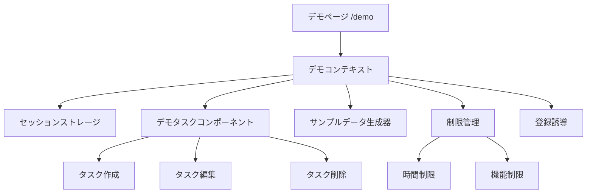

# 設計書

## 概要

デモシステムは、認証なしでタスク管理アプリケーションの主要機能を体験できる独立したページです。セッションベースのデータ管理により、ユーザーは実際のアプリケーションと同様の操作感を得ながら、データベースへの永続化は行わずにメモリ内でデータを管理します。

## アーキテクチャ

### システム構成



### データフロー

1. **初期化**: デモページアクセス時にサンプルデータを生成
2. **操作**: ユーザーの操作をセッションストレージに反映
3. **制限チェック**: 各操作時に制限事項を確認
4. **クリーンアップ**: セッション終了時にデータを削除

## コンポーネントと インターフェース

### フロントエンド コンポーネント

#### 1. DemoPage (`/demo`)
- **責任**: デモ環境の全体制御
- **機能**:
  - デモコンテキストの初期化
  - 制限事項の表示
  - 登録への誘導

#### 2. DemoProvider
- **責任**: デモ状態の管理
- **機能**:
  - セッションストレージとの連携
  - サンプルデータの生成
  - タスク操作の処理

#### 3. DemoTaskList
- **責任**: デモ用タスクリストの表示
- **機能**:
  - 既存TaskListコンポーネントの拡張
  - デモ制限の適用
  - AIチャット機能の非表示

#### 4. DemoTaskForm
- **責任**: デモ用タスク作成フォーム
- **機能**:
  - 既存TaskFormコンポーネントの拡張
  - 制限チェック機能

#### 5. DemoLimitationBanner
- **責任**: 制限事項の表示
- **機能**:
  - 残り時間の表示
  - 機能制限の説明
  - 登録ボタンの表示

### バックエンド API（オプション）

#### 1. デモセッション管理 API
- **エンドポイント**: `/api/demo/session`
- **機能**: デモセッションの作成と管理（必要に応じて）

## データモデル

### DemoTask インターフェース
```typescript
interface DemoTask {
  id: string;
  title: string;
  description?: string;
  completed: boolean;
  expires_at?: number;
  created_at: number;
  source_type: 'demo';
}
```

### DemoSession インターフェース
```typescript
interface DemoSession {
  id: string;
  tasks: DemoTask[];
  created_at: number;
  expires_at: number;
  limitations: {
    max_tasks: number;
    max_duration: number;
    current_task_count: number;
  };
}
```

### サンプルデータ構造
```typescript
const SAMPLE_TASKS: DemoTask[] = [
  {
    id: 'demo-1',
    title: 'プロジェクト企画書の作成',
    description: '新しいプロジェクトの企画書を作成し、チームに共有する',
    completed: false,
    expires_at: Date.now() + (7 * 24 * 60 * 60 * 1000), // 7日後
    created_at: Date.now() - (2 * 24 * 60 * 60 * 1000), // 2日前
    source_type: 'demo'
  },
  {
    id: 'demo-2',
    title: 'クライアントミーティングの準備',
    description: '来週のクライアントミーティングの資料準備',
    completed: true,
    expires_at: Date.now() + (3 * 24 * 60 * 60 * 1000), // 3日後
    created_at: Date.now() - (1 * 24 * 60 * 60 * 1000), // 1日前
    source_type: 'demo'
  },
  {
    id: 'demo-3',
    title: 'システムのバックアップ確認',
    description: 'データベースとファイルシステムのバックアップ状況を確認',
    completed: false,
    expires_at: Date.now() + (1 * 24 * 60 * 60 * 1000), // 1日後
    created_at: Date.now() - (3 * 60 * 60 * 1000), // 3時間前
    source_type: 'demo'
  }
];
```

## エラーハンドリング

### 制限エラー
- **タスク数制限**: 最大10個のタスクまで作成可能
- **時間制限**: 30分間のデモセッション
- **機能制限**: AI機能、外部連携機能は無効

### エラー表示パターン
```typescript
interface DemoLimitation {
  type: 'task_limit' | 'time_limit' | 'feature_disabled';
  message: string;
  action?: 'upgrade' | 'register';
}
```

## テスト戦略

### 単体テスト
- DemoProviderの状態管理
- サンプルデータ生成
- 制限チェック機能

### 統合テスト
- デモページの初期化
- タスクCRUD操作
- セッション管理

### E2Eテスト
- デモフロー全体
- 登録への遷移
- 制限到達時の動作

## セキュリティ考慮事項

### データ保護
- セッションストレージのみ使用（永続化なし）
- 個人情報の収集なし
- セッション終了時の自動クリーンアップ

### リソース保護
- 同時デモセッション数の制限
- セッション時間の制限
- メモリ使用量の監視

## パフォーマンス最適化

### フロントエンド
- コンポーネントの遅延読み込み
- セッションストレージの効率的な使用
- 不要な再レンダリングの防止

### リソース管理
- 期限切れセッションの自動削除
- メモリリークの防止
- ガベージコレクションの最適化

## 実装フェーズ

### フェーズ1: 基本機能
- デモページの作成
- サンプルデータの表示
- 基本的なタスク操作

### フェーズ2: 制限機能
- 時間制限の実装
- タスク数制限の実装
- 制限表示UI

### フェーズ3: 登録誘導
- 登録ボタンの実装
- 制限到達時の誘導
- データインポート機能（オプション）

## 技術仕様

### 使用技術
- **フロントエンド**: Next.js 15, TypeScript, Tailwind CSS
- **状態管理**: React Context + useReducer
- **ストレージ**: SessionStorage
- **UI コンポーネント**: shadcn/ui

### ブラウザサポート
- Chrome 90+
- Firefox 88+
- Safari 14+
- Edge 90+

### アクセシビリティ
- WCAG 2.1 AA準拠
- キーボードナビゲーション対応
- スクリーンリーダー対応
- 適切なARIAラベル