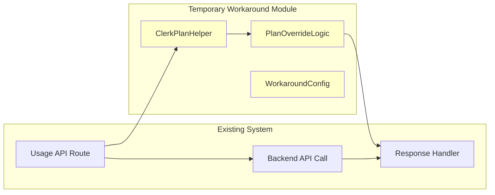

# 設計書

## 概要

バックエンドのClerk Python SDKでサブスクリプションプラン情報が取得できない問題に対する暫定対応として、フロントエンドのNext.js API ルート（サーバーサイド）でClerk JavaScript SDKを使用してプラン情報を取得し、バックエンドから返される値を上書きする機能を設計します。この実装は既存のアーキテクチャを維持しながら、最小限の変更で問題を解決し、将来的な削除を容易にする設計とします。

## アーキテクチャ

### システム構成図

```mermaid
graph TB
    subgraph "Frontend Client"
        UI[AIChatModal]
        Hook[useAIChatUsage Hook]
    end

    subgraph "Next.js API Routes (Server-side)"
        UsageAPI[/api/ai/usage]
        ClerkHelper[Clerk Plan Helper]
        PlanOverride[Plan Override Logic]
    end

    subgraph "Backend API"
        BackendAPI[/api/ai/usage Backend]
        UsageService[AIChatUsageService]
        ClerkService[ClerkService - 問題あり]
    end

    subgraph "External Services"
        ClerkJS[Clerk JavaScript SDK]
        ClerkPython[Clerk Python SDK - 問題あり]
    end

    UI --> Hook
    Hook --> UsageAPI
    UsageAPI --> BackendAPI
    UsageAPI --> ClerkHelper
    ClerkHelper --> ClerkJS
    BackendAPI --> UsageService
    UsageService --> ClerkService
    ClerkService --> ClerkPython
    UsageAPI --> PlanOverride
    PlanOverride --> UI

    style ClerkService fill:#ffcccc
    style ClerkPython fill:#ffcccc
    style ClerkHelper fill:#ccffcc
    style PlanOverride fill:#ccffcc
```

### データフロー（暫定対応）

1. **通常フロー**: フロントエンド → Next.js API → バックエンドAPI → レスポンス
2. **暫定対応フロー**:
   - バックエンドAPIからレスポンス取得
   - 並行してClerk JavaScript SDKでプラン情報取得
   - プラン情報でレスポンスを上書き
   - 修正されたレスポンスをフロントエンドに返却

### 暫定対応の分離設計



## コンポーネントとインターフェース

### 新規作成するモジュール

#### 1. Clerk Plan Helper (`utils/clerkPlanHelper.ts`)

```typescript
/**
 * 暫定対応: Clerk JavaScript SDKを使用したプラン取得
 * TODO: Clerk Python SDKが修正されたら削除予定
 */

import { auth, clerkClient } from '@clerk/nextjs/server';

export interface ClerkPlanResult {
  plan: string;
  success: boolean;
  error?: string;
  source: 'subscription' | 'metadata' | 'fallback';
}

export class ClerkPlanHelper {
  /**
   * 暫定対応: フロントエンドでユーザープランを取得
   * @returns プラン情報とメタデータ
   */
  static async getUserPlan(): Promise<ClerkPlanResult> {
    try {
      const { userId } = auth();

      if (!userId) {
        return {
          plan: 'free',
          success: false,
          error: 'User not authenticated',
          source: 'fallback'
        };
      }

      const user = await clerkClient.users.getUser(userId);

      // 1. サブスクリプション情報から取得を試行
      if (user.publicMetadata?.subscription) {
        const subscription = user.publicMetadata.subscription as any;
        if (subscription.plan) {
          return {
            plan: String(subscription.plan).toLowerCase(),
            success: true,
            source: 'subscription'
          };
        }
      }

      // 2. メタデータから直接取得を試行
      if (user.publicMetadata?.plan) {
        return {
          plan: String(user.publicMetadata.plan).toLowerCase(),
          success: true,
          source: 'metadata'
        };
      }

      // 3. プライベートメタデータもチェック
      if (user.privateMetadata?.plan) {
        return {
          plan: String(user.privateMetadata.plan).toLowerCase(),
          success: true,
          source: 'metadata'
        };
      }

      // 4. フォールバック
      return {
        plan: 'free',
        success: true,
        source: 'fallback'
      };

    } catch (error) {
      console.error('[TEMPORARY WORKAROUND] Clerk plan retrieval error:', error);
      return {
        plan: 'free',
        success: false,
        error: String(error),
        source: 'fallback'
      };
    }
  }
}
```

#### 2. Plan Override Logic (`utils/planOverrideLogic.ts`)

```typescript
/**
 * 暫定対応: バックエンドレスポンスのプラン情報上書きロジック
 * TODO: Clerk Python SDKが修正されたら削除予定
 */

import { AIChatUsage } from '@/types/AIChatUsage';
import { PLAN_LIMITS } from '@/types/AIChatUsage';
import { ClerkPlanResult } from './clerkPlanHelper';

export interface PlanOverrideResult {
  data: AIChatUsage;
  wasOverridden: boolean;
  originalPlan?: string;
  newPlan?: string;
  error?: string;
}

export class PlanOverrideLogic {
  /**
   * 暫定対応: バックエンドレスポンスのプラン情報を上書き
   * @param backendResponse バックエンドからのレスポンス
   * @param clerkPlan フロントエンドで取得したプラン情報
   * @returns 上書き後のレスポンス
   */
  static overridePlanInformation(
    backendResponse: AIChatUsage,
    clerkPlan: ClerkPlanResult
  ): PlanOverrideResult {
    try {
      // フロントエンドでのプラン取得が失敗した場合は上書きしない
      if (!clerkPlan.success) {
        return {
          data: backendResponse,
          wasOverridden: false,
          error: clerkPlan.error
        };
      }

      const originalPlan = backendResponse.plan_name;
      const newPlan = clerkPlan.plan as 'free' | 'standard';

      // プランが同じ場合は上書き不要
      if (originalPlan === newPlan) {
        return {
          data: backendResponse,
          wasOverridden: false,
          originalPlan,
          newPlan
        };
      }

      // プラン情報を上書きして関連フィールドを再計算
      const newDailyLimit = PLAN_LIMITS[newPlan];
      const currentUsage = backendResponse.current_usage || 0;
      const newRemainingCount = Math.max(0, newDailyLimit - currentUsage);
      const newCanUseChat = newDailyLimit > 0 && currentUsage < newDailyLimit;

      const overriddenResponse: AIChatUsage = {
        ...backendResponse,
        plan_name: newPlan,
        daily_limit: newDailyLimit,
        remaining_count: newRemainingCount,
        can_use_chat: newCanUseChat
      };

      console.log(`[TEMPORARY WORKAROUND] Plan overridden: ${originalPlan} → ${newPlan}`);

      return {
        data: overriddenResponse,
        wasOverridden: true,
        originalPlan,
        newPlan
      };

    } catch (error) {
      console.error('[TEMPORARY WORKAROUND] Plan override error:', error);
      return {
        data: backendResponse,
        wasOverridden: false,
        error: String(error)
      };
    }
  }

  /**
   * プラン変更が有効かどうかを検証
   * @param originalPlan 元のプラン
   * @param newPlan 新しいプラン
   * @returns 有効な変更かどうか
   */
  static isValidPlanChange(originalPlan?: string, newPlan?: string): boolean {
    const validPlans = ['free', 'standard'];
    return validPlans.includes(originalPlan || '') && validPlans.includes(newPlan || '');
  }
}
```

#### 3. Workaround Configuration (`config/workaroundConfig.ts`)

```typescript
/**
 * 暫定対応の設定管理
 * TODO: Clerk Python SDKが修正されたら削除予定
 */

export interface WorkaroundConfig {
  enabled: boolean;
  timeout: number;
  retryCount: number;
  logLevel: 'debug' | 'info' | 'warn' | 'error';
  cacheEnabled: boolean;
  cacheTtl: number;
}

export const WORKAROUND_CONFIG: WorkaroundConfig = {
  enabled: true, // 暫定対応を有効にするかどうか
  timeout: 5000, // Clerk API呼び出しのタイムアウト（ms）
  retryCount: 2, // リトライ回数
  logLevel: 'info', // ログレベル
  cacheEnabled: true, // キャッシュを有効にするか
  cacheTtl: 300000, // キャッシュTTL（5分）
};

export class WorkaroundLogger {
  static log(level: string, message: string, data?: any) {
    const prefix = '[TEMPORARY WORKAROUND]';

    switch (level) {
      case 'debug':
        console.debug(`${prefix} ${message}`, data);
        break;
      case 'info':
        console.info(`${prefix} ${message}`, data);
        break;
      case 'warn':
        console.warn(`${prefix} ${message}`, data);
        break;
      case 'error':
        console.error(`${prefix} ${message}`, data);
        break;
    }
  }
}
```

### 既存ファイルの修正

#### 1. `/api/ai/usage/route.ts` の更新

```typescript
import { AIChatUsage, AIChatUsageError } from "@/types/AIChatUsage";
import { apiGet } from "@/utils/api";
import { NextResponse } from "next/server";

// 暫定対応: Clerk JavaScript SDKでのプラン取得
// TODO: Clerk Python SDKが修正されたら以下のimportを削除
import { ClerkPlanHelper } from "@/utils/clerkPlanHelper";
import { PlanOverrideLogic } from "@/utils/planOverrideLogic";
import { WORKAROUND_CONFIG, WorkaroundLogger } from "@/config/workaroundConfig";

/**
 * GET /api/ai/usage
 * Fetch AI Chat usage information for the authenticated user
 *
 * 暫定対応: バックエンドのClerk Python SDK問題により、
 * フロントエンドでプラン情報を取得してレスポンスを上書き
 */
export async function GET(): Promise<NextResponse> {
  try {
    // バックエンドAPIからの基本レスポンス取得
    const response = await apiGet<AIChatUsage>('/ai/usage');

    if (response.error) {
      // エラーレスポンスの処理（既存ロジック）
      const status = response.error.status || 500;

      if (status === 403 || status === 429) {
        const errorResponse: AIChatUsageError = {
          error: response.error.message,
          error_code: response.error.details?.error_code || 'SYSTEM_ERROR',
          remaining_count: response.error.details?.remaining_count || 0,
          reset_time: response.error.details?.reset_time || new Date(Date.now() + 24 * 60 * 60 * 1000).toISOString(),
        };

        return NextResponse.json(errorResponse, { status });
      }

      return NextResponse.json(
        {
          error: response.error.message || 'システムエラーが発生しました',
          error_code: 'SYSTEM_ERROR',
          remaining_count: 0,
          reset_time: new Date(Date.now() + 24 * 60 * 60 * 1000).toISOString(),
        } as AIChatUsageError,
        { status }
      );
    }

    // 暫定対応: プラン情報の上書き処理
    if (WORKAROUND_CONFIG.enabled && response.data) {
      try {
        WorkaroundLogger.log('info', 'Starting plan override process');

        // フロントエンドでプラン情報を取得
        const clerkPlan = await ClerkPlanHelper.getUserPlan();

        WorkaroundLogger.log('debug', 'Clerk plan retrieved', {
          plan: clerkPlan.plan,
          success: clerkPlan.success,
          source: clerkPlan.source
        });

        // プラン情報でレスポンスを上書き
        const overrideResult = PlanOverrideLogic.overridePlanInformation(
          response.data,
          clerkPlan
        );

        if (overrideResult.wasOverridden) {
          WorkaroundLogger.log('info', 'Plan information overridden', {
            originalPlan: overrideResult.originalPlan,
            newPlan: overrideResult.newPlan
          });
        }

        return NextResponse.json(overrideResult.data);

      } catch (workaroundError) {
        // 暫定対応でエラーが発生した場合は元のレスポンスを返す
        WorkaroundLogger.log('error', 'Workaround failed, using original response', workaroundError);
        return NextResponse.json(response.data);
      }
    }

    // 暫定対応が無効な場合は元のレスポンスをそのまま返す
    return NextResponse.json(response.data);

  } catch (error) {
    // 既存のエラーハンドリング
    console.error('AI Usage API Error:', error);

    const errorResponse: AIChatUsageError = {
      error: 'システムエラーが発生しました',
      error_code: 'SYSTEM_ERROR',
      remaining_count: 0,
      reset_time: new Date(Date.now() + 24 * 60 * 60 * 1000).toISOString(),
    };

    return NextResponse.json(errorResponse, { status: 500 });
  }
}
```

## データモデル

### 暫定対応用の型定義

```typescript
// types/workaround.ts - 暫定対応専用の型定義
// TODO: Clerk Python SDKが修正されたら削除予定

export interface TemporaryWorkaroundMetrics {
  totalOverrides: number;
  successfulOverrides: number;
  failedOverrides: number;
  averageResponseTime: number;
  lastOverrideTime: string;
  planDistribution: Record<string, number>;
}

export interface WorkaroundLogEntry {
  timestamp: string;
  action: 'plan_retrieval' | 'plan_override' | 'error';
  success: boolean;
  originalPlan?: string;
  newPlan?: string;
  error?: string;
  responseTime?: number;
}
```

### キャッシュ機能の設計

```typescript
// utils/planCache.ts - プラン情報のキャッシュ
// TODO: Clerk Python SDKが修正されたら削除予定

interface CachedPlan {
  plan: string;
  timestamp: number;
  ttl: number;
}

export class PlanCache {
  private static cache = new Map<string, CachedPlan>();

  static set(userId: string, plan: string, ttl: number = 300000): void {
    this.cache.set(userId, {
      plan,
      timestamp: Date.now(),
      ttl
    });
  }

  static get(userId: string): string | null {
    const cached = this.cache.get(userId);

    if (!cached) return null;

    if (Date.now() - cached.timestamp > cached.ttl) {
      this.cache.delete(userId);
      return null;
    }

    return cached.plan;
  }

  static clear(): void {
    this.cache.clear();
  }
}
```

## エラーハンドリング

### エラー分類と対応戦略

1. **Clerk JavaScript SDK エラー**
   - タイムアウト: 5秒でタイムアウト、元のレスポンス使用
   - 認証エラー: ログ出力、freeプランにフォールバック
   - API制限: 指数バックオフでリトライ

2. **プラン上書きエラー**
   - 型変換エラー: ログ出力、元のレスポンス使用
   - 計算エラー: ログ出力、元のレスポンス使用
   - 予期しないエラー: ログ出力、元のレスポンス使用

3. **パフォーマンス問題**
   - レスポンス時間監視: 3秒を超える場合は警告ログ
   - メモリ使用量監視: キャッシュサイズ制限
   - API呼び出し頻度制限: レート制限の実装

### フォールバック戦略

```typescript
export class WorkaroundFallbackStrategy {
  static async executeWithFallback<T>(
    primaryAction: () => Promise<T>,
    fallbackAction: () => T,
    timeoutMs: number = 5000
  ): Promise<T> {
    try {
      // タイムアウト付きで主要処理を実行
      const result = await Promise.race([
        primaryAction(),
        new Promise<never>((_, reject) =>
          setTimeout(() => reject(new Error('Timeout')), timeoutMs)
        )
      ]);

      return result;
    } catch (error) {
      WorkaroundLogger.log('warn', 'Primary action failed, using fallback', error);
      return fallbackAction();
    }
  }
}
```

## テスト戦略

### 単体テスト

1. **ClerkPlanHelper のテスト**
   - 正常なプラン取得のテスト
   - 各種エラーケースのテスト
   - フォールバック処理のテスト

2. **PlanOverrideLogic のテスト**
   - プラン上書きロジックのテスト
   - 関連フィールド再計算のテスト
   - エラーハンドリングのテスト

3. **キャッシュ機能のテスト**
   - キャッシュの保存・取得テスト
   - TTL期限切れのテスト
   - メモリリーク防止のテスト

### 統合テスト

1. **API エンドポイントのテスト**
   - 暫定対応有効時の動作テスト
   - 暫定対応無効時の動作テスト
   - エラー時のフォールバック動作テスト

2. **パフォーマンステスト**
   - レスポンス時間の測定
   - 同時リクエスト処理のテスト
   - メモリ使用量の監視

### E2Eテスト

1. **ユーザーシナリオテスト**
   - 各プランでのAIチャット利用テスト
   - プラン変更時の動作テスト
   - エラー状態からの復旧テスト

## セキュリティ考慮事項

### 認証・認可

1. **Clerk認証の確認**
   - ユーザー認証状態の検証
   - セッション有効性の確認
   - 権限レベルの検証

2. **API セキュリティ**
   - CSRF保護の維持
   - レート制限の実装
   - 入力値検証の強化

### データ保護

1. **個人情報の取り扱い**
   - プラン情報の適切な処理
   - ログ出力時の個人情報マスキング
   - キャッシュデータの暗号化

2. **エラー情報の制御**
   - 詳細なエラー情報の内部ログ化
   - ユーザー向けエラーメッセージの簡素化
   - デバッグ情報の本番環境での非表示

## パフォーマンス最適化

### レスポンス時間の最適化

1. **並行処理の活用**
   - バックエンドAPI呼び出しとClerk API呼び出しの並行実行
   - タイムアウト設定による応答性の確保

2. **キャッシュ戦略**
   - プラン情報の短期キャッシュ（5分）
   - メモリベースキャッシュによる高速アクセス

3. **API呼び出しの最適化**
   - 必要最小限のフィールドのみ取得
   - 条件付きリクエストの活用

### メモリ使用量の最適化

1. **キャッシュサイズ制限**
   - 最大1000エントリまでのキャッシュ
   - LRU方式による古いエントリの削除

2. **オブジェクト生成の最小化**
   - 不要なオブジェクト生成の回避
   - プリミティブ型の活用

## 監視とメトリクス

### 運用監視

1. **成功率の監視**
   - プラン取得成功率
   - 上書き処理成功率
   - エラー発生率

2. **パフォーマンス監視**
   - 平均レスポンス時間
   - 95パーセンタイルレスポンス時間
   - API呼び出し頻度

3. **ビジネスメトリクス**
   - プラン別利用状況
   - 暫定対応の使用頻度
   - ユーザー体験への影響

### ログ出力戦略

```typescript
export class WorkaroundMetrics {
  private static metrics: TemporaryWorkaroundMetrics = {
    totalOverrides: 0,
    successfulOverrides: 0,
    failedOverrides: 0,
    averageResponseTime: 0,
    lastOverrideTime: '',
    planDistribution: {}
  };

  static recordOverride(success: boolean, responseTime: number, plan?: string): void {
    this.metrics.totalOverrides++;

    if (success) {
      this.metrics.successfulOverrides++;
      if (plan) {
        this.metrics.planDistribution[plan] = (this.metrics.planDistribution[plan] || 0) + 1;
      }
    } else {
      this.metrics.failedOverrides++;
    }

    // 移動平均でレスポンス時間を更新
    this.metrics.averageResponseTime =
      (this.metrics.averageResponseTime * (this.metrics.totalOverrides - 1) + responseTime) /
      this.metrics.totalOverrides;

    this.metrics.lastOverrideTime = new Date().toISOString();
  }

  static getMetrics(): TemporaryWorkaroundMetrics {
    return { ...this.metrics };
  }
}
```

## 削除計画

### 削除の判断基準

1. **Clerk Python SDK の修正確認**
   - 公式リリースノートの確認
   - テスト環境での動作検証
   - 本番環境での段階的検証

2. **削除の実行手順**
   - 暫定対応の無効化（設定変更）
   - 動作確認期間（1週間）
   - 暫定対応コードの削除
   - 関連テストの削除

### 削除対象ファイル一覧

```
// 削除予定ファイル（TODO: Clerk Python SDK修正後）
utils/clerkPlanHelper.ts
utils/planOverrideLogic.ts
utils/planCache.ts
config/workaroundConfig.ts
types/workaround.ts

// 修正が必要なファイル
frontend/app/api/ai/usage/route.ts (暫定対応部分の削除)
```

### 削除時の影響確認

1. **機能テスト**
   - AIチャット機能の正常動作確認
   - プラン別制限の正常動作確認
   - エラーハンドリングの動作確認

2. **パフォーマンステスト**
   - レスポンス時間の改善確認
   - メモリ使用量の削減確認
   - API呼び出し回数の削減確認

この設計により、既存システムへの影響を最小限に抑えながら、Clerk Python SDKの問題を回避し、将来的な削除を容易にする暫定対応を実現します。