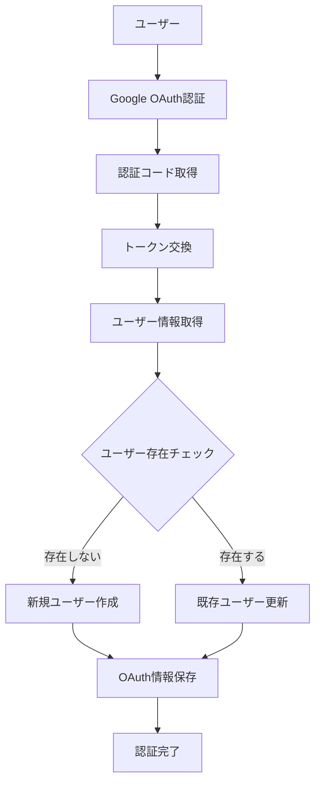

# 設計書

## 概要

Google OAuth認証システムを統合し、新規登録時にGoogle OAuth認証情報を直接保存し、ログイン認証もGoogle OAuth情報に基づいて行うシステムに改修する。これにより、ユーザーは一度のGoogle認証でアカウント作成とサービス連携を完了できる。

## アーキテクチャ

### 現在のアーキテクチャの問題点

1. **分離された認証フロー**: ユーザー登録（Clerk/Email）とGoogle OAuth連携が独立している
2. **重複した認証手順**: ログイン後に再度Google OAuth認証が必要
3. **不要なリレーションシップ**: User.google_oauth_tokensが存在するが実際の認証には使用されていない

### 新しいアーキテクチャ



## コンポーネントと インターフェース

### 1. データベーススキーマの変更

#### User テーブル
```python
class User(SQLModel, table=True):
    # google_oauth_tokens リレーションシップを削除
    # 他のフィールドは変更なし
```

#### GoogleOAuthToken テーブル
```python
class GoogleOAuthToken(SQLModel, table=True):
    # 構造は変更なし
    # ただし、ユーザー認証の主要な情報源として使用
```

### 2. サービス層の改修

#### GoogleOauthService の拡張
```python
class GoogleOauthService:
    def create_or_update_user_with_oauth(
        self,
        credentials: Credentials,
        user_info: dict
    ) -> tuple[User, GoogleOAuthToken]:
        """Google OAuth認証情報を使用してユーザーを作成または更新"""

    def authenticate_user_by_google_email(
        self,
        google_email: str
    ) -> Optional[User]:
        """Google emailでユーザー認証を行う"""

    def refresh_token_if_needed(
        self,
        oauth_token: GoogleOAuthToken
    ) -> GoogleOAuthToken:
        """トークンの有効期限をチェックし、必要に応じてリフレッシュ"""

    def validate_and_refresh_credentials(
        self,
        user_id: int
    ) -> Optional[Credentials]:
        """ユーザーの認証情報を検証し、期限切れの場合はリフレッシュ"""
```

#### 認証サービスの統合
```python
# 新しい認証フロー
def authenticate_with_google_oauth(
    callback_request: GoogleCallbackRequest
) -> tuple[User, GoogleOAuthToken]:
    """Google OAuth認証を使用した統合認証"""
```

### 3. リポジトリ層の拡張

#### google_oauth_token リポジトリ
```python
def find_user_by_google_email(
    google_email: str,
    session: Session
) -> Optional[User]:
    """Google emailでユーザーを検索"""

def create_user_with_oauth_token(
    user_data: dict,
    oauth_data: dict,
    session: Session
) -> tuple[User, GoogleOAuthToken]:
    """ユーザーとOAuth情報を同時に作成"""
```

### 4. API エンドポイントの改修

#### Google OAuth コールバック
```python
@router.post("/callback")
async def google_oauth_callback(
    request: GoogleCallbackRequest,
    session: Session = Depends(get_session),
):
    """
    統合された認証フロー:
    1. OAuth認証情報を取得
    2. ユーザー情報を取得
    3. ユーザーが存在しない場合は新規作成
    4. OAuth情報を保存/更新
    5. 認証完了レスポンスを返す
    """
```

#### 新しい認証状態チェック
```python
@router.get("/auth-status")
async def get_auth_status(
    session: Session = Depends(get_session),
):
    """Google OAuth認証状態をチェック"""
```

## データモデル

### 新しいレスポンスモデル
```python
class GoogleAuthCompleteResponse(BaseModel):
    success: bool
    message: str
    user: UserModel
    is_new_user: bool

class GoogleAuthStatusResponse(BaseModel):
    authenticated: bool
    user: Optional[UserModel]
    google_email: Optional[str]
```

### 内部データフロー
```python
# OAuth認証完了時のデータフロー
GoogleCallbackRequest -> OAuth認証 -> ユーザー情報取得 ->
ユーザー作成/更新 -> OAuth情報保存 -> GoogleAuthCompleteResponse
```

## エラーハンドリング

### 1. OAuth認証エラー
- 無効な認証コード
- トークン交換失敗
- ユーザー情報取得失敗

### 2. データベースエラー
- ユーザー作成失敗
- OAuth情報保存失敗
- トランザクション失敗

### 3. セキュリティエラー
- 暗号化/復号化失敗
- 不正なアクセス試行
- トークン期限切れ

### エラーレスポンス統一
```python
class GoogleOAuthError(Exception):
    def __init__(self, message: str, error_code: str, status_code: int = 400):
        self.message = message
        self.error_code = error_code
        self.status_code = status_code
```

## テスト戦略

### 1. 単体テスト
- GoogleOauthService の各メソッド
- リポジトリ層の CRUD 操作
- 暗号化/復号化機能

### 2. 統合テスト
- OAuth認証フロー全体
- データベーストランザクション
- API エンドポイント

### 3. エラーケーステスト
- 無効な認証コード
- ネットワークエラー
- データベース接続エラー

## トークンリフレッシュ戦略

### 1. 自動リフレッシュ機能
```python
def auto_refresh_token(self, oauth_token: GoogleOAuthToken) -> GoogleOAuthToken:
    """
    トークンの自動リフレッシュ:
    1. 有効期限をチェック（期限切れ30分前に実行）
    2. リフレッシュトークンを使用してアクセストークンを更新
    3. 新しいトークンを暗号化してデータベースに保存
    4. 失敗時は適切なエラーハンドリング
    """
```

### 2. リフレッシュトークンの管理
- **永続化**: リフレッシュトークンは暗号化してデータベースに保存
- **ローテーション**: 新しいアクセストークン取得時にリフレッシュトークンも更新
- **失効処理**: リフレッシュ失敗時はユーザーに再認証を要求

### 3. トークン有効期限の監視
```python
def check_token_expiry(self, oauth_token: GoogleOAuthToken) -> bool:
    """
    トークン有効期限チェック:
    - 現在時刻と有効期限を比較
    - 30分以内に期限切れの場合はTrue
    - 期限切れまたは無効な場合はTrue
    """
```

### 4. バックグラウンドリフレッシュ
- **定期実行**: 期限切れ前のトークンを定期的にリフレッシュ
- **非同期処理**: ユーザーのリクエストをブロックしない
- **エラー処理**: リフレッシュ失敗時の適切な通知

## セキュリティ考慮事項

### 1. トークン管理
- アクセストークンとリフレッシュトークンの暗号化
- トークンの適切な有効期限管理
- トークンローテーション
- リフレッシュトークンの安全な保存と管理

### 2. ユーザー情報保護
- 個人情報の最小限保存
- Google email の適切な検証
- CSRF 攻撃対策

### 3. 認証状態管理
- セッション管理の強化
- 不正アクセス検出
- ログ記録とモニタリング

## 移行戦略

### 1. データベース移行
```sql
-- User テーブルからリレーションシップ削除のマイグレーション
-- 既存データの整合性確保
```

### 2. 段階的デプロイ
1. 新しいサービス層の実装
2. API エンドポイントの更新
3. フロントエンドの統合
4. 既存機能の互換性確認

### 3. ロールバック計画
- データベーススキーマのロールバック
- サービス層の切り戻し
- API エンドポイントの復元

## パフォーマンス最適化

### 1. データベースクエリ最適化
- インデックスの適切な設定
- N+1 クエリ問題の回避
- 接続プールの最適化

### 2. キャッシュ戦略
- ユーザー情報のキャッシュ
- OAuth トークンの適切なキャッシュ
- レスポンス時間の改善

### 3. 非同期処理
- OAuth認証の非同期化
- バックグラウンドでのトークン更新
- エラー処理の非同期化