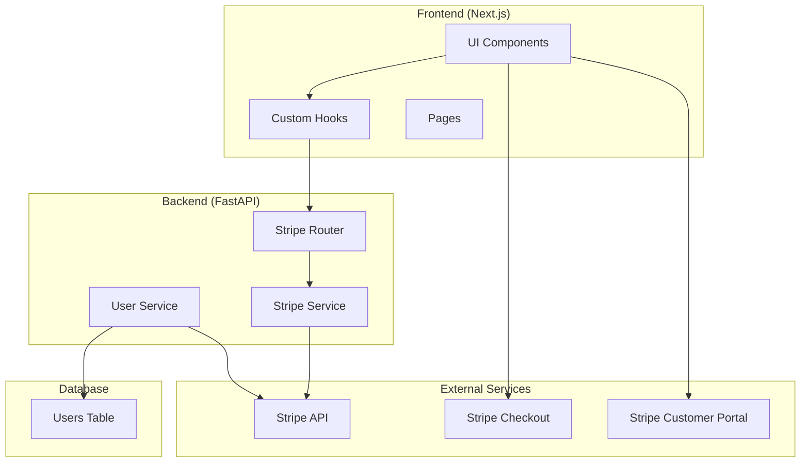

# 設計書

## 概要

Clerk BillingからStripe SDKへの完全移行を実現する設計。既存のアーキテクチャパターン（Router → Service → Repository → Database）を維持しながら、Stripeの機能を統合し、セキュアで拡張可能なサブスクリプション管理システムを構築する。

## アーキテクチャ

### システム全体図



### データフロー

1. **ユーザー登録時**: Clerk認証でUser作成（Clerk機能のみ使用）
2. **初回サブスクリプション関連アクセス時**: UserService.ensure_stripe_customer → Stripe Customer作成 → stripe_customer_id保存
3. **サブスクリプション購入**: Frontend → Stripe Checkout → 支払い完了
4. **サブスクリプション管理**: Frontend → Stripe Customer Portal → 変更・キャンセル
5. **機能アクセス制御**: Frontend → `/api/users/me` → Stripe APIから最新サブスクリプション情報取得 → 結果返却

**重要**: サブスクリプション情報はStripe APIから直接取得し、ローカルDBには保存しない。
これにより、常に最新で正確な情報を保証し、データ同期の複雑さを回避する。

## コンポーネントとインターフェース

### Backend Components

#### 1. User Service (`backend/app/services/user_service.py`)

```python
class UserService:
    async def ensure_stripe_customer(self, user: User) -> str
    async def get_user_with_subscription(self, user_id: int) -> UserWithSubscription
    async def update_user_stripe_customer_id(self, user_id: int, stripe_customer_id: str) -> User
```

#### 2. Stripe Service (`backend/app/services/stripe_service.py`)

```python
class StripeService:
    async def create_customer(self, user: User) -> str
    async def get_customer(self, stripe_customer_id: str) -> stripe.Customer
    async def get_customer_subscriptions(self, stripe_customer_id: str) -> list[stripe.Subscription]
    async def get_active_subscription(self, stripe_customer_id: str) -> stripe.Subscription | None
    async def create_checkout_session(self, customer_id: str, price_id: str, success_url: str, cancel_url: str) -> stripe.checkout.Session
    async def create_customer_portal_session(self, customer_id: str, return_url: str) -> stripe.billing_portal.Session

    # Note: キャッシュはエンドポイントレベルで実装
    # Stripe APIを直接呼び出し、シンプルな実装を維持
```


#### 3. Stripe Router (`backend/app/routers/api/stripe.py`)

```python
@router.post("/create-checkout-session")
async def create_checkout_session(request: CheckoutSessionRequest, user: User = Depends(auth_user))

@router.post("/create-portal-session")
async def create_portal_session(user: User = Depends(auth_user))


```

#### 4. Users Router 拡張 (`backend/app/routers/api/users.py`)

```python
from fastapi_cache.decorator import cache

@router.get("/me")
@cache(expire=300)  # 5分間のエンドポイントレベルキャッシュ
async def get_current_user(user: User = Depends(auth_user)) -> UserWithSubscription:
    # Stripe APIからサブスクリプション情報を取得
    # isPremium, planName, expiresAt などの情報を含む
    # エンドポイントレベルで5分間キャッシュしてパフォーマンスを最適化
```

### Frontend Components

#### 1. User Hook 拡張 (`frontend/components/hooks/useUser.ts`)

```typescript
interface UserWithSubscription {
  id: number;
  uuid: string;
  email: string;
  name: string;
  subscription: {
    isPremium: boolean;
    planName: string | null;
    status: string | null;
    currentPeriodEnd: number | null;
    cancelAtPeriodEnd: boolean;
  } | null;
}

interface UseUserReturn {
  user: UserWithSubscription | null;
  isLoading: boolean;
  error: string | null;
  isPremium: boolean;
  refreshUser: () => Promise<void>;
}
```

#### 2. Subscription Hook (`frontend/components/hooks/useSubscription.ts`)

```typescript
interface UseSubscriptionReturn {
  createCheckoutSession: (priceId: string) => Promise<void>;
  openCustomerPortal: () => Promise<void>;
  isLoading: boolean;
  error: string | null;
}
```

#### 3. Subscription Page (`frontend/app/(authed)/subscription/page.tsx`)

- Stripe Pricing Tableの統合
- 現在のプラン表示
- Customer Portalへのリンク

#### 4. Premium Feature Guard (`frontend/components/components/commons/PremiumGuard.tsx`)

Clerkの`<Protect>`コンポーネントを置き換える新しいコンポーネント

```typescript
interface PremiumGuardProps {
  children: React.ReactNode;
  fallback?: React.ReactNode;
  showUpgrade?: boolean;
}
```

## データモデル

### 1. Users Table 拡張

```sql
ALTER TABLE users ADD COLUMN stripe_customer_id VARCHAR(255) UNIQUE;
CREATE INDEX idx_users_stripe_customer_id ON users(stripe_customer_id);
```

### 2. User モデル拡張のみ

```python
# User モデルにStripe Customer IDのみ追加
class User(SQLModel, table=True):
    # ... 既存のフィールド ...
    stripe_customer_id: str | None = Field(default=None, unique=True, index=True)

# サブスクリプション情報はStripe APIから直接取得するため、
# ローカルDBにSubscriptionsテーブルは作成しない
```

### 3. レスポンス型定義

```python
# API レスポンス用の型定義
class SubscriptionInfo(BaseModel):
    isPremium: bool
    planName: str | None
    status: str | None
    currentPeriodEnd: int | None
    cancelAtPeriodEnd: bool

class UserWithSubscription(BaseModel):
    id: int
    uuid: str
    email: str
    name: str
    subscription: SubscriptionInfo | None
```

## エラーハンドリング

### Backend Error Handling

1. **Stripe API エラー**
   - Rate limiting: 指数バックオフで再試行
   - Invalid request: 詳細なエラーメッセージをログに記録
   - Authentication errors: 設定確認を促すメッセージ

2. **Webhook エラー**
   - 署名検証失敗: セキュリティログに記録
   - 処理失敗: 再試行キューに追加
   - 重複イベント: idempotency keyで重複処理を防止

3. **Database エラー**
   - 制約違反: 適切なHTTPステータスコードで応答
   - 接続エラー: ヘルスチェックエンドポイントで監視

### Frontend Error Handling

1. **API エラー**
   - Network errors: 再試行ボタン付きエラー表示
   - Authentication errors: ログイン画面にリダイレクト
   - Subscription errors: サポート連絡先を表示

2. **Stripe Checkout エラー**
   - Payment failures: エラーメッセージと再試行オプション
   - Session expired: 新しいセッション作成

## テスト戦略

### Backend Testing

1. **Unit Tests**
   - StripeService: モックを使用したStripe API呼び出しテスト
   - SubscriptionRepository: データベース操作テスト
   - WebhookHandler: イベント処理ロジックテスト

2. **Integration Tests**
   - Stripe Test Mode APIを使用した実際のAPI呼び出しテスト
   - Webhook エンドポイントのテスト
   - データベース統合テスト

3. **E2E Tests**
   - サブスクリプション購入フローテスト
   - キャンセル・更新フローテスト

### Frontend Testing

1. **Component Tests**
   - PremiumGuard: 権限制御ロジックテスト
   - Subscription components: UI状態テスト

2. **Hook Tests**
   - useSubscription: API呼び出しとstate管理テスト

3. **Integration Tests**
   - Stripe Checkout統合テスト
   - Customer Portal統合テスト

## セキュリティ考慮事項

### API Security

1. **Webhook Security**
   - Stripe署名検証の実装
   - HTTPS必須
   - Rate limiting

2. **API Key Management**
   - 環境変数での管理
   - Test/Live mode の適切な分離
   - 最小権限の原則

### Data Protection

1. **PII Protection**
   - 支払い情報はStripeに保存、ローカルには保存しない
   - ログに機密情報を含めない

2. **Access Control**
   - サブスクリプション状態の検証はバックエンドで実行
   - フロントエンドでの権限チェックは表示制御のみ

## パフォーマンス最適化

### Backend Optimization

1. **Database Optimization**
   - 適切なインデックス設計
   - Connection pooling

2. **API Optimization & Caching**
   - **エンドポイントレベルキャッシュ**: `@cache`デコレータで5分間のレスポンスキャッシュ
   - ユーザー単位での適切なキャッシュ分離
   - Stripe API呼び出しの最小化

### Frontend Optimization

1. **State Management**
   - React Queryによるクライアントサイドキャッシュ
   - 不要な再レンダリングの防止
   - 適切なstaleTime設定（5分）

2. **Loading States**
   - Stripe Checkout読み込み中の適切なUI表示
   - Progressive loading

## 移行戦略

### Phase 1: Infrastructure Setup
1. Stripe アカウント設定
2. データベーススキーマ更新
3. 基本的なStripe Service実装

### Phase 2: Core Functionality
1. Customer作成・管理機能
2. Subscription CRUD操作
3. Webhook処理

### Phase 3: Frontend Integration
1. Pricing Table統合
2. Customer Portal統合
3. Premium feature guards

### Phase 4: Migration & Cleanup
1. 既存Clerk Billing機能の無効化
2. データ移行（必要に応じて）
3. 旧コードの削除

## 監視とログ

### Monitoring

1. **Stripe Dashboard**
   - 支払い状況の監視
   - エラー率の追跡
   - Webhook配信状況

2. **Application Monitoring**
   - サブスクリプション関連APIのレスポンス時間
   - エラー率とエラー内容
   - データベースパフォーマンス

### Logging

1. **Structured Logging**
   - JSON形式でのログ出力
   - 相関IDによるリクエスト追跡
   - 機密情報の除外

2. **Audit Logging**
   - サブスクリプション変更の記録
   - 支払い関連イベントの記録
   - セキュリティイベントの記録